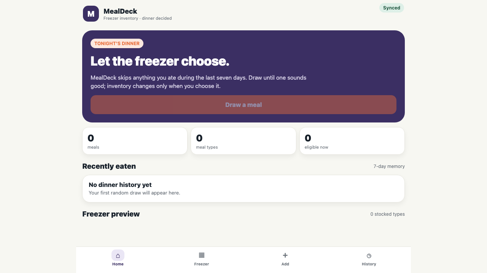

# MealDeck

MealDeck is a local-first meal-inventory app that tracks prepared meals and
chooses dinner without repeating a meal eaten during the previous seven days.



## What it demonstrates

- Guided capture and review of meal-card information.
- Local/offline inventory with an optional Spring Boot backend.
- Nutrition per serving, duplicate-name consolidation, and meal history.
- Atomic shipment confirmation, inventory changes, and undoable dinner draws.

## AI interaction flow

1. A user captures the front and back of a meal card.
2. The extraction path identifies meal details and sends the result through a
   human review step.
3. The app normalizes the approved meal into inventory and reusable templates.
4. Deterministic eligibility rules choose dinner and update history and stock.

Spring AI is an optional extraction path; the core inventory and dinner rules
remain deterministic and available in local mode.

## Technology used

- **Expo / React Native / React Native Web** — provide the mobile and web UI.
- **TypeScript** — implement local data handling and typed client behavior.
- **Java 21 / Spring Boot** — provide the optional backend API.
- **Spring AI** — supports optional meal-card extraction.
- **Spring Data JPA / H2** — persist and test inventory and history rules.
- **ZXing** — decode barcodes and QR payloads from meal cards.

## Quick start

Run the local web app without a backend:

```bash
cd mobile
npm install
npm run web
```

For the backend:

```bash
./mvnw -f backend/pom.xml test
```

The mobile app remains usable in local mode when no API URL is configured.

## Further reading

- [Architecture](docs/ARCHITECTURE.md)
- [API notes](docs/API.md)
- [Contributor guidance](AGENTS.md)
- [Product roadmap](ROADMAP.md)
